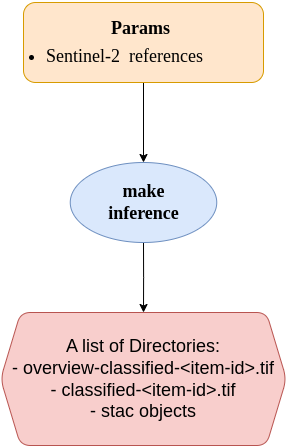

# Inference Module & CWL Runner

In the [training module](training-container.md), a CNN model was trained on the EuroSAT dataset to classify image chips into 10 different land use/land cover classes. The training workflow was tracked using MLflow.

This Application Package provides a CWL document that performs inference by applying the trained model to unseen Sentinel-2 data in order to generate a classified image. The CWL document contains a single main workflow that executes one `CommandLineTool` step. It also supports parallel execution by accepting a list of Sentinel-2 references as input, making it suitable for running at scale on a Minikube cluster.

To execute the application, users have the option to use either [cwltool](https://github.com/common-workflow-language/cwltool) or [Calrissian](https://github.com/Duke-GCB/calrissian) as the CWL runner.

## Inputs:
- `input_reference`: A list of Sentinel-2 product references from [Planetary Computer](https://planetarycomputer.microsoft.com/api/stac/v1/collections). Note: the inference application provides accurate results only when the Sentinel-2 product has low or no cloud cover. High cloud coverage may significantly reduce prediction accuracy.

## How to Execute the Application Package

Before running the application with a CWL runner, make sure to download and use the latest version of the CWL document:

```bash
cd inference/app-package
VERSION=$(curl -s https://api.github.com/repos/eoap/machine-learning-process/releases/latest | jq -r '.tag_name')
curl -L -o "tile-sat-inference.cwl" \
  "https://github.com/eoap/machine-learning-process/releases/download/${VERSION}/tile-sat-inference.${VERSION}.cwl"
```

### **Run the Application Package**:
There are two methods to execute the application:

- Executing `tile-sat-inference` using `cwltool`:

    ```bash
    cwltool --podman --debug --parallel tile-sat-inference.cwl#tile-sat-inference params.yml
    ```

- Executing `tile-sat-inference` using `calrissian`:

    ```bash
    
    calrissian --debug --stdout /calrissian/out.json --stderr /calrissian/stderr.log --usage-report /calrissian/report.json --max-ram 10G --max-cores 2 --parallel --tmp-outdir-prefix /calrissian/tmp/ --outdir /calrissian/results/ --tool-logs-basepath /calrissian/logs tile-sat-inference.cwl#tile-sat-inference params.yml
    ```
  > You can monitor the pod creation using command below:
  >
  >   `kubectl get pods` 

## How the CWL document is designed:
The CWL file can be triggered using `cwltool` or `calrissian`. The execution requires a `params.yml` file, which supplies all the necessary inputs defined in the CWL specification. The workflow is structured to run the module according to the diagram outlined below:



The Application Package will generate a number of directories containing intermediate and final outputs. Each directory will contain a `{STAC_ITEM_ID}_classified.tif` file, along with the corresponding STAC objects (i.e. the STAC Catalog and STAC Item). The number of directories depends on the number of input Sentinel-2 products provided. 


## Troubleshooting

Users might encounter memory-related issues when executing workflows with CWL Runners (especially with `cwltool`). These issues can often be mitigated by reducing the `ramMax` parameter (e.g. `ramMax: 1000`) specified in the CWL file, which can help prevent excessive memory allocation.